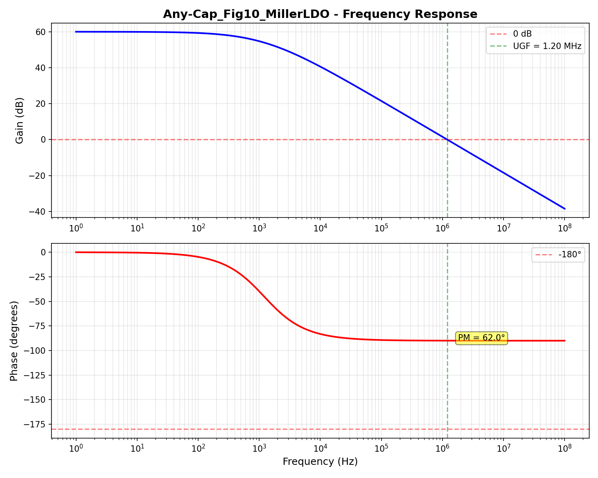

# Any-Cap_Fig10_MillerLDO 设计报告

**生成时间**: 2025-12-11 00:50:27
**电路类型**: small_signal

## 电路拓扑

- **来源**: Any-Cap Low Dropout Voltage Regulator.pdf
- **页码**: 27
- **描述**: Block Diagram of Miller-Compensated LDO Regulator (Small-Signal Model)
- **器件数**: 11

## 仿真结果

### AC性能指标

| 指标 | 值 |
|------|-----|
| 单位增益频率 (UGF) | 1.20 MHz |
| 相位裕度 (PM) | 62.0° |
| 增益裕度 (GM) | 12.0 dB |

## 验证结果

### ✓ 验证通过

- ✓ **相位裕度**: 62.0° (要求 >45°)
- **UGF**: 1.20 MHz

## 网表文件

**路径**: `design_agent\workspace\Any-Cap_Fig10_MillerLDO_smallsignal.sp`

## Bode图

